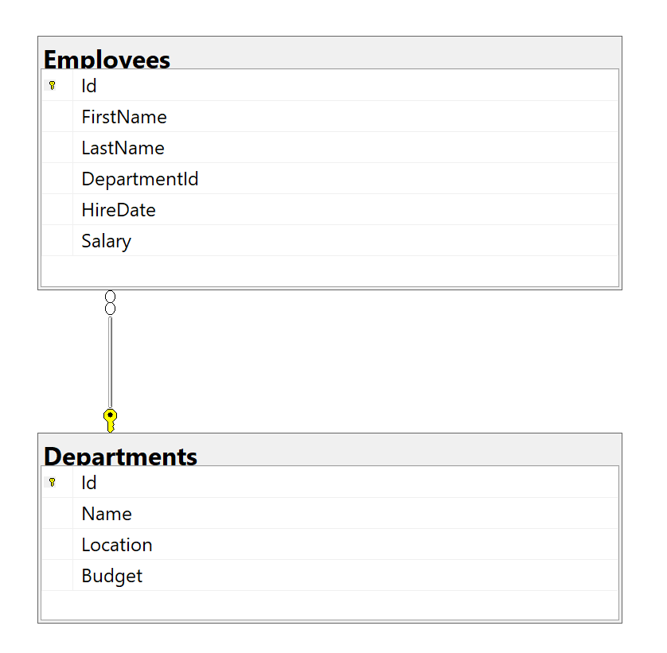

# Шаг 1: Справочники

## Справочники

1. **Справочник сотрудников**
2. **Справочник отделов**

## Перечень колонок

### Справочник сотрудников (Employees):
- **Id** (int, Primary Key) — Уникальный идентификатор сотрудника.
- **FirstName** (nvarchar(50)) — Имя сотрудника.
- **LastName** (nvarchar(50)) — Фамилия сотрудника.
- **DepartmentId** (int, Foreign Key) — Идентификатор отдела из справочника отделов.
- **HireDate** (date) — Дата приема на работу.
- **Salary** (decimal(18, 2)) — Зарплата сотрудника.

### Справочник отделов (Departments):
- **Id** (int, Primary Key) — Уникальный идентификатор отдела.
- **Name** (nvarchar(100)) — Наименование отдела.
- **Location** (nvarchar(100)) — Местоположение отдела.
- **Budget** (decimal(18, 2)) — Бюджет отдела.

# Шаг 2: Проектирование и создание таблиц

## Выбор СУБД
**СУБД**: SQLite

## Схема БД

```sql
CREATE TABLE Departments (
    Id INTEGER PRIMARY KEY AUTOINCREMENT,
    Name TEXT NOT NULL,
    Location TEXT NOT NULL,
    Budget REAL NOT NULL
);

CREATE TABLE Employees (
    Id INTEGER PRIMARY KEY AUTOINCREMENT,
    FirstName TEXT NOT NULL,
    LastName TEXT NOT NULL,
    DepartmentId INTEGER,
    HireDate DATE NOT NULL,
    Salary REAL NOT NULL,
    FOREIGN KEY (DepartmentId) REFERENCES Departments(Id)
);
```


## Пример заполнения данных

### Вставка данных

```sql
INSERT INTO Departments (Name, Location, Budget) VALUES
('Отдел продаж', 'Минск', 150000.00),
('Отдел разработки', 'Гомель', 200000.00),
('Отдел маркетинга', 'Витебск', 100000.00);

INSERT INTO Employees (FirstName, LastName, DepartmentId, HireDate, Salary) VALUES
('Иван', 'Иванов', 1, '2020-02-15', 50000.00),
('Мария', 'Петрова', 2, '2019-06-01', 60000.00),
('Александр', 'Сидоров', 1, '2021-08-20', 55000.00);
```
